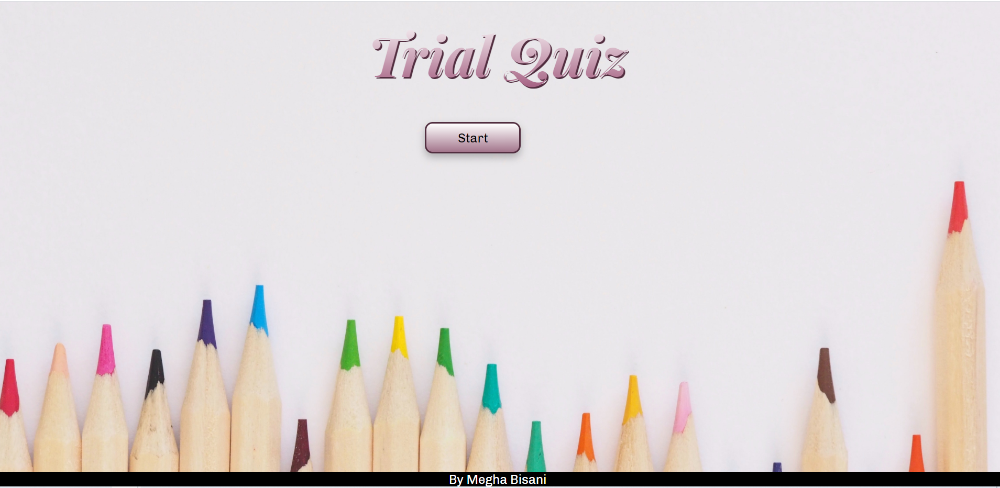
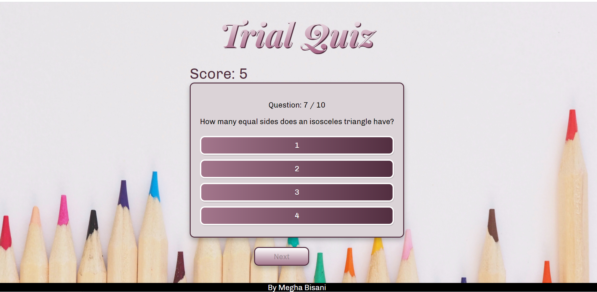
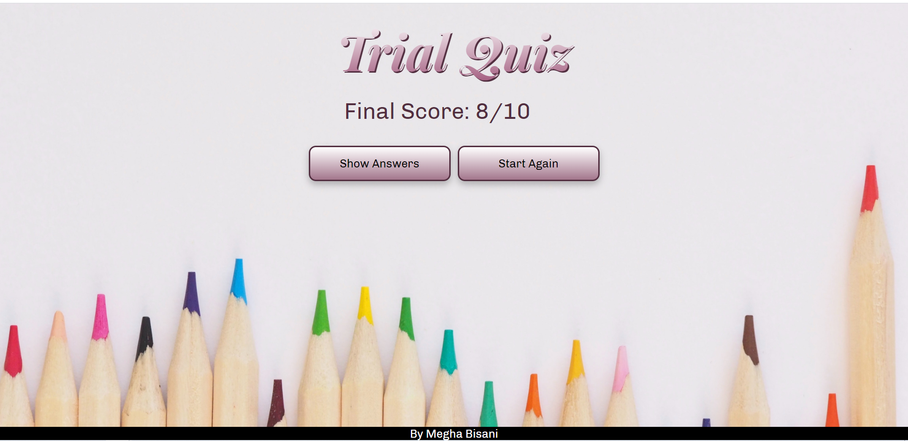
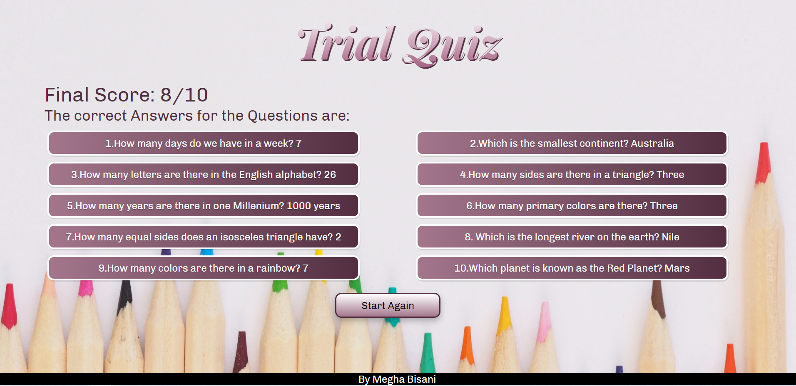

## React Quiz App

A quiz application build in react to conduct Multiple Choice Questions quiz. 
The application has the following features:

- Quiz contain Multiple Choice Questions up to four choices.
- User can view the all the answers at the end of the quiz, if user wishes to do so.
- User can start the quiz again without looking at all the correct answers, if user wishes to do so.
- User can see the current score after every question, no need to wait for the score at the end of the quiz.
- `Next` button will be enabled after one option/answer is selected.
- `Submit` button will be enabled after all questions are answered.
- Quiz can be taken in all platform devices.

### Prerequisites
- Basic knowledge about React, styled -component and css, etc.
- Install node and npm.

### Getting Started

- Clone this repo
- `npm install` to get required dependency packages. 
- `npm start` to start the local server (this project uses create-react-app).

### Snaps from the app

- Greetings/Start page

- During the Quiz

- Result page at the end

- Answers page, if user wishes to see all answers

### Contributing

- If you have problems please leave an issue from [here](https://github.com/meghabisani/react_quiz_app/issues). 
- Consider forking the project and submitting new pull requests.

### You can reach out 😊😊

- Feel free to contact me about the problems. I will try to help as much as I can 😉 
- Mail-Id: meghabisani@outlook.com

## Acknowledgments

- Getting Better at React. 
- Learning new stuffs.
